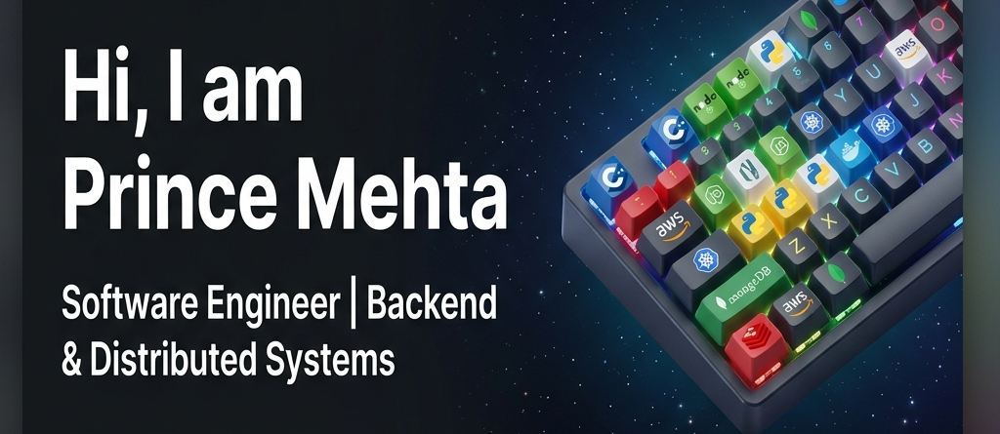

  

  
  

---

### 👨‍💻 About Me

I am a B.Tech Computer Science student focused on building **scalable systems**, **high-performance applications**, and **production-ready software**. My core interests lie at the intersection of backend engineering, distributed systems, and artificial intelligence.

- 🔭 I’m currently working on high-performance compute engines and distributed platforms.
- 🌱 I’m currently learning **Kubernetes**, **Observability (OpenTelemetry)**, and **Cloud Infrastructure**.
- 💬 Ask me about **C++, Node.js, System Design, or Backend Architecture**.
- ⚡ **Philosophy**: *Build systems that are reliable, scalable, and easy to reason about.*

---

### 🛠️ Tech Stack

<table>
  <tr>
    <td align="center" width="96">
        
       C++
    </td>
    <td align="center" width="96">
        
       Node.js
    </td>
    <td align="center" width="96">
        
       Python
    </td>
    <td align="center" width="96">
        
       Javascript
    </td>
    <td align="center" width="96">
        
       Express
    </td>
    <td align="center" width="96">
        
       MongoDB
    </td>
  </tr>
  <tr>
    <td align="center" width="96">
        
       Redis
    </td>
    <td align="center"  width="96">
        
       Kafka
    </td>
    <td align="center"  width="96">
        
       Docker
    </td>
    <td align="center" width="96">
        
       Kubernetes
    </td>
    <td align="center"  width="96">
        
       AWS
    </td>
    <td align="center" width="96">
        
       React
    </td>
  </tr>
</table>

---

### 🚀 Featured Projects

| Project | Description | Tech Stack |
| :--- | :--- | :--- |
| **[KnightMare](https://github.com/CreatorguyS/KnightMare)** | High-performance chess engine using bitboards. | `C++` `WebAssembly` |
| **[Forensic Synopsis Generator](https://github.com/CreatorguyS/Forensic-synopsis-generator)** | AI-powered forensic video analysis. | `Python` `AI/ML` `CV` |
| **[url_shortner_analytics](https://github.com/CreatorguyS/url_shortner_analytics)** | Scalable URL shortener service with advanced analytics. | `Node.js` `Redis` `MongoDB` |
| **[AyroPath](https://github.com/CreatorguyS/AyroPath)** | Route optimization and predictive paths. | `Node.js` `React` `AI` |
| **[kyo](https://github.com/CreatorguyS/kyo)** | Specialized lightweight service and application logic component. | `Backend` `Systems` |

---

### 📈 GitHub Stats

  
   
   
  

---

 

  

